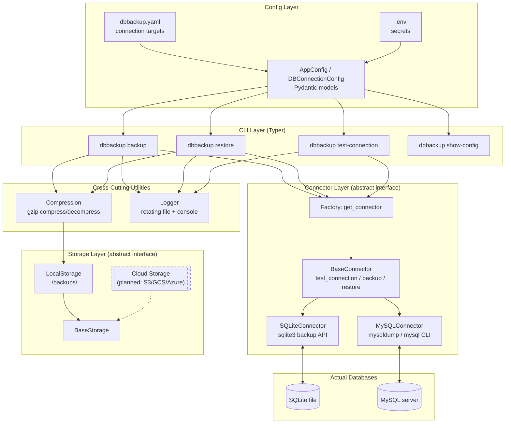

# dbbackup — Database Backup & Restore CLI

A command-line utility for backing up and restoring databases, built in Python. Supports multiple database management systems through a pluggable connector architecture, with compression, logging, OS-level scheduling, and safe restore operations.

> Status: Core functionality complete for **SQLite** and **MySQL**. PostgreSQL, MongoDB, cloud storage (S3/GCS/Azure), Slack notifications, and selective restore are designed for but not yet implemented — see [Roadmap](#roadmap--deferred-features).

---

## Features

- **Multi-DBMS connectors** — SQLite and MySQL supported today, via a common abstract interface designed to extend to PostgreSQL, MongoDB, and others.
- **Config-driven** — connection targets defined in a YAML file; secrets (passwords) kept out of version control via `.env`.
- **Full backups** — SQLite via its native backup API (safe even against a live/writing database); MySQL via `mysqldump --single-transaction` for a consistent snapshot without locking tables.
- **Compression** — backups are gzip-compressed automatically (`--no-compress` to disable).
- **Logging** — every backup/restore logs start time, end time, duration, and status/errors to a rotating log file and the console.
- **Local storage** — backups land in a local `backups/` directory; storage is abstracted so cloud backends can be added later without touching backup logic.
- **OS-level scheduling** — designed to run unattended via Windows Task Scheduler (or cron on Linux/macOS) using a simple wrapper script — no daemon or long-running process required.
- **Restore** — full restore for both SQLite and MySQL, with a mandatory interactive confirmation before overwriting live data.
- **Automated tests** — pytest regression tests verify backup → restore round-trips correctly for each supported DBMS.

---

## Architecture

The tool is organized around three pluggable interfaces — **connectors** (how to talk to a DBMS), **storage backends** (where backup files end up), and **config** (how targets and secrets are defined) — so new database types or storage destinations can be added without changing the CLI or existing code.



**Flow for a backup:** CLI resolves the named target from config → factory returns the matching connector → connector performs the DBMS-native backup → file is compressed → storage layer places the final file → the whole run is logged.

**Flow for a restore:** CLI resolves the target and decompresses the backup if needed → user is prompted for explicit confirmation (destructive operation) → connector replays/copies the backup into the live database → the run is logged.

### Design principles behind the structure

- **Strategy pattern for connectors** — `BaseConnector` defines `test_connection()`, `backup()`, and `restore()`; each DBMS implements them its own way (binary file copy for SQLite, `mysqldump`/`mysql` subprocess calls for MySQL). The CLI never needs to know which DBMS it's talking to.
- **Same pattern for storage** — `BaseStorage` currently has one implementation (`LocalStorage`), but adding S3 later means writing an `S3Storage` class, not modifying the backup command.
- **Secrets never touch version control** — YAML config references `${ENV_VAR}` placeholders resolved from `.env` at runtime; `.env` and `dbbackup.yaml` are both gitignored, only `*.example` versions are tracked.
- **Fail safe, not silent** — connection tests run before backup/restore attempts; partial/corrupt backup files are deleted on failure; restore always requires explicit confirmation.

---

## Project Structure

```
db-backup-cli/
├── dbbackup/
│   ├── cli.py                     # Typer CLI entry point — all commands
│   ├── connectors/
│   │   ├── base.py                # BaseConnector abstract class + ConnectorError
│   │   ├── sqlite_connector.py    # SQLite implementation
│   │   ├── mysql_connector.py     # MySQL implementation (mysqldump / mysql CLI)
│   │   └── factory.py             # get_connector() — picks implementation by db_type
│   ├── storage/
│   │   ├── base.py                # BaseStorage abstract class
│   │   └── local_storage.py       # Local filesystem storage
│   └── utils/
│       ├── config.py              # Pydantic config models + YAML/env loader
│       ├── compression.py         # gzip compress/decompress helpers
│       └── logger.py              # Rotating file + console logger
├── tests/
│   ├── conftest.py                # Shared pytest fixtures (app_config)
│   ├── test_sqlite_restore.py     # SQLite backup→restore round-trip test
│   └── test_mysql_restore.py      # MySQL backup→restore round-trip test
├── backups/                       # Backup output (gitignored)
├── logs/                          # Rotating log files (gitignored)
├── run_backup.bat                 # Wrapper script for OS-level scheduling
├── dbbackup.example.yaml          # Template config (tracked)
├── dbbackup.yaml                  # Real config with your targets (gitignored)
├── .env.example                   # Template secrets file (tracked)
├── .env                           # Real secrets (gitignored)
├── pytest.ini                     # pytest path configuration
└── requirements.txt
```

---

## Installation

```bash
git clone <your-repo-url>
cd db-backup-cli
python -m venv venv

# Windows
venv\Scripts\Activate.ps1
# macOS/Linux
source venv/bin/activate

pip install -r requirements.txt
```

MySQL support additionally requires the `mysql` and `mysqldump` CLI tools to be installed and available on your system `PATH` (these ship with MySQL Server / MySQL Workbench installs).

---

## Configuration

1. Copy the example files:
   ```bash
   cp dbbackup.example.yaml dbbackup.yaml
   cp .env.example .env
   ```

2. Define your targets in `dbbackup.yaml`:
   ```yaml
   targets:
     - name: local_sqlite
       db_type: sqlite
       file_path: ./sample.db

     - name: local_mysql
       db_type: mysql
       host: localhost
       port: 3306
       username: dbbackup_user
       password: ${MYSQL_ROOT_PASSWORD}
       database: dbbackup_test
   ```

3. Put actual secrets in `.env` (never committed):
   ```
   MYSQL_ROOT_PASSWORD=your_actual_password
   ```

   `${VAR_NAME}` placeholders in `dbbackup.yaml` are resolved from `.env` / the environment at load time.

> **Note on MySQL users:** it's recommended to create a dedicated MySQL user scoped to only the databases you want backed up, rather than using `root`:
> ```sql
> CREATE USER 'dbbackup_user'@'localhost' IDENTIFIED BY 'your_password';
> GRANT ALL PRIVILEGES ON your_database.* TO 'dbbackup_user'@'localhost';
> FLUSH PRIVILEGES;
> ```

---

## Usage

### Show configured targets
```bash
python -m dbbackup.cli show-config
```

### Test a connection
```bash
python -m dbbackup.cli test-connection <target-name>
```

### Run a backup
```bash
python -m dbbackup.cli backup <target-name>
python -m dbbackup.cli backup <target-name> --no-compress   # skip gzip
```

Backups are written to `backups/<target>_<timestamp>.<ext>.gz` (`.db` for SQLite, `.sql` for MySQL) and logged to `logs/dbbackup.log`.

### Restore a backup
```bash
python -m dbbackup.cli restore <target-name> backups/<backup-file>.gz
```

You will be prompted to confirm before anything is overwritten:
```
⚠️  This will overwrite the 'target-name' database. Continue? [y/N]:
```

Accepts both compressed (`.gz`) and raw backup files.

### Full command reference
```bash
python -m dbbackup.cli --help
```

---

## Scheduling (OS-level)

Automatic backups are handled by the OS scheduler rather than an in-process daemon — this is the same approach production backup tools use, and it means backups keep running even if you're not actively working on the project.

**`run_backup.bat`** wraps the backup command so it can run non-interactively:
```bat
@echo off
cd /d "<path-to-project>"
".\venv\Scripts\python.exe" -m dbbackup.cli backup local_mysql
```

**Windows:** create a Basic Task in Task Scheduler pointing at `run_backup.bat`, with whatever trigger (daily, hourly, etc.) fits your needs.

**Linux/macOS equivalent** (not yet set up in this project, but the same script pattern applies via cron):
```cron
0 2 * * * /path/to/project/venv/bin/python -m dbbackup.cli backup local_mysql
```

> The `restore` command is intentionally **not** suitable for scheduling — it requires interactive confirmation by design, since it's a destructive operation.

---

## Testing

```bash
python -m pytest tests/ -v
```

Current tests verify, for both SQLite and MySQL:
1. A known data state is backed up.
2. The live database is then modified ("damaged").
3. Restoring from the backup returns the database to the exact pre-damage state.

---

## Security Notes

- Credentials are never hardcoded or committed — they live in `.env`, which is gitignored.
- MySQL backup/restore currently passes the password via CLI flag to `mysqldump`/`mysql`, which is acceptable for local/personal use but not ideal on shared multi-user servers (process lists can sometimes expose command-line arguments). A future improvement would be using `--defaults-extra-file` with a temporary, permission-restricted credentials file.
- Restore operations always require explicit interactive confirmation and are never wired into scheduled/unattended execution.
- Partial or failed backup files are deleted rather than left in place looking valid.

---

## Roadmap / Deferred Features

The connector and storage abstractions were built so these can be added without restructuring existing code:

- [ ] PostgreSQL connector (via `pg_dump` / `pg_restore`)
- [ ] MongoDB connector (via `mongodump` / `mongorestore`)
- [ ] Cloud storage backends: AWS S3, Google Cloud Storage, Azure Blob Storage
- [ ] Slack notifications on backup completion/failure
- [ ] Selective restore (specific tables/collections rather than the full database)
- [ ] Incremental / differential backup strategies (currently full backups only)
- [ ] Cross-platform scheduling docs (cron setup tested on Linux/macOS)

---

## License

Personal / educational project.